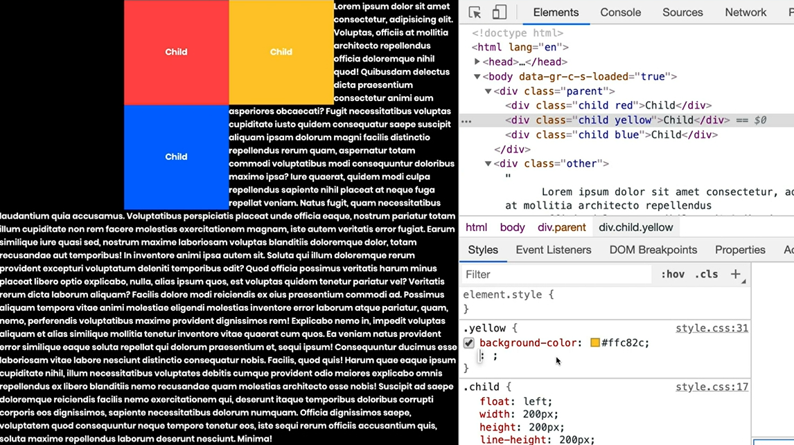

# Float

Float 를 배우는 이유 : block 요소들을 가로배치하기 위해


# Float -> What happens

1. 떠다님 (float의 사전적 의미처럼)

   `red -> float: left`


2. 요소가 block으로 바뀜

3. block인데 길막은 하지못함

   - 자동으로 부모의 width를 갖지 못하고 content의 크기만큼의 width를 가짐
   - 기존의 block처럼 남은 부분을 margin으로 채우지도 않음

   `red, yellow -> float: left`


​	여기서 파란색도 float를 하면 파란색은 빨간색 아래로 붙고, 부모의 height는 0이 된다.

4. float가 일어나면 block요소들을 float 영역을 없는 것처럼 취급하지만, inline 요소들은 float의 영역을 볼 수 있음. 결국 뒤죽박죽 섞이게 됨.




# Float -> How to fix it

1. Honeyful Trick : 부모한테 `overflow: hidden; `
2. FM : **Clearfix**


clear 속성의 값은 left, right, both 가 있음

clear 속성을 위해 무의미한 요소를 만들기보다는 css를 통해 fix 추천

- Pseudo-Element (HTML에는 존재하지 않는 가상요소 + clear: left;)
- `::before`, `::after`를 통해 앞 또는 뒤에 가상요소를 만들 수 있음
- 가상 요소에는 반드시 content 속성 필요
- 가상 요소는 box type의 default는 inline이고 추가 속성을 줄 수 있음
- box type을 inline-block, block으로 바꿀 수도 있음
- clear 속성을 주기 위해서는 display: block 으로


```css
/* clear를 위해서는 parent에 적용 */
.parent::after {
    content: "";
    display: block;
    clear: left;
}
```

